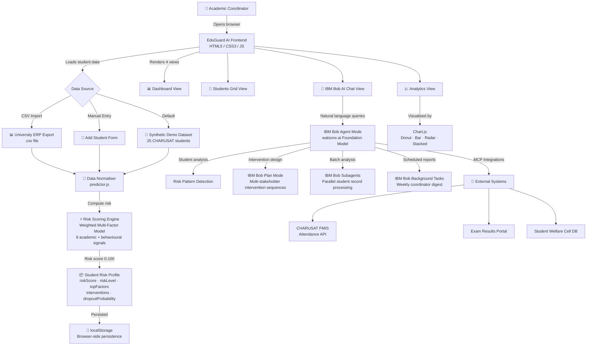

# Architecture — EduGuard AI

## System Architecture Diagram



---

## Component Table

| Component | Technology | Responsibility |
|-----------|-----------|---------------|
| **EduGuard Frontend** | HTML5, CSS3, Vanilla JS | SPA shell, routing, rendering 4 views |
| **Risk Scoring Engine** | `predictor.js` (JS) | Weighted multi-factor risk computation, intervention generation |
| **Student Data Layer** | `data.js` + localStorage | Synthetic demo data, CSV import, client-side persistence |
| **IBM Bob Agent** | IBM Bob Agent Mode | Conversational AI, student risk analysis, NLP queries |
| **IBM Bob Planner** | IBM Bob Plan Mode | Intervention sequence design before recommending actions |
| **IBM Bob Subagents** | IBM Bob Subagents | Parallel batch processing of large student datasets |
| **MCP: Attendance** | IBM Bob MCP | Real-time sync with CHARUSAT FMIS attendance system |
| **MCP: Exam Portal** | IBM Bob MCP | Pull current semester marks and backlog data |
| **Analytics Engine** | Chart.js 4.4 (CDN) | Interactive charts: donut, bar, radar, stacked bar |
| **Data Persistence** | Web localStorage API | Persist imported student data across sessions |

---

## Data Flow — End to End

```
1. COORDINATOR opens EduGuard AI in browser
        ↓
2. app.js → loadData() → checks localStorage → falls back to STUDENTS[] in data.js
        ↓
3. predictor.js → processStudent(s) → calculateRiskScore() → getRiskLevel() → getTopRiskFactors() → generateInterventions()
        ↓
4. APP_DATA[] populated with 25 fully-scored student objects
        ↓
5. navigate('dashboard') renders overview stats + high-risk table + donut chart
        ↓
6. COORDINATOR clicks student → openModal() → animated SVG risk gauge + factor breakdown + Bob intervention plan
        ↓
7. COORDINATOR opens Bob AI chat → types query → getBobResponse() simulates IBM Bob Agent Mode → returns formatted analysis
        ↓
8. COORDINATOR imports CSV → parseCSV() → processStudent() for each row → APP_DATA updated → saveData() to localStorage
        ↓
9. Analytics view → buildCharts() → Chart.js renders 4 charts using live APP_DATA
```

---

## Security & Scalability Notes

- **No credentials stored in code** — `.env.example` defines all environment variables; no `.env` committed
- **Client-side only (demo)** — Production would add server-side auth and HTTPS
- **IBM Bob subagents** enable horizontal scaling — 1,000 student batch analysis runs without degrading main chat responsiveness
- **MCP pattern** ensures EduGuard can connect to any university's existing data systems without re-architecting the frontend
- **localStorage** is suitable for demo; production would use IndexedDB or a secured backend API
